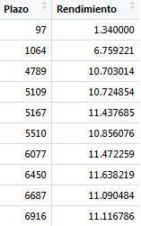

## Contenido 

  - Antecedentes y motivación 
  - Objetivos  generales del trabajo
  - Objetivos específicos del trabajo
  - Enfoque Metodológico
    - Elaboración de la base de datos
    - Estimación de parámetros y curva de rendimientos
  - Resultados
  - Conclusiones y Recomendaciones

# Antecedentes y motivación

##Curva de rendimientos

<font size=6 style="padding-left:100px;">La curva de redimientos es una herramienta ampliamente utilizada por los bancos centrales en sus decisiones de política monetaria, así como también por los agentes privados en la planificación de sus inversiones en instrumentos financieros [1].</font> 
  
  
<font size=6 style="padding-left:100px;">La misma tiene importancia capital para el mundo académico y práctico desde el punto de vista económico y financiero, ya que refleja el precio intertemporal del dinero.</font>
  
  
<font size=6 style="padding-left:100px;">Uno de los principales objetivos que se persigue con esta herramienta es estimar los precios de los títulos de la deuda pública nacional que posee una institución financiera en su portafolio de inversiones en un período determinado.</font>

##

<font size=6 style="padding-left:100px;">Para ello es importante conocer las características de los títulos ó instrumentos que existen en el mercado venezolano, entre ellos tenemos los siguientes,</font>


 - <font size=6><b><font color="#0B97ED">Títulos de interés fijo (TIF)</font></b>: son instrumentos que se caracterizan por tener una renta fija y se emiten en moneda nacional.</font>

 - <font size=6><b><font color="#0B97ED">Títulos de interés variable (VEBONO)</font></b>: se caracterizan por poseer una  renta variable e igual que los TIF se emiten en bolívares.</font>
   
 - <font size=6><b><font color="#0B97ED">Bonos PDVSA</font></b>: son instrumentos emitidos en dólares.</font>


<font size=6 style="padding-left:100px;">En el presente trabajo sólo  se considerarán VEBONOS y TIF, es decir, aquellos instrumentos emitidos en bolívares.</font>

##

<font size=6 style="padding-left:100px;">Asociado a cada título hay un monto de dinero que se invierte, una fecha de emisión y una fecha de vencimiento, día en el cual el ente emisor retorna el monto invertido inicialmente.</font>

<font size=6 style="padding-left:100px;">Con el fin de determinar en cuál título es mejor invertir, es necesario conocer el rendimiento al vencimiento que posee dicho título. A partir de la siguiente fórmula podemos hallar el valor del rendimiento al vencimiento,</font>

<div class="centered">
$\displaystyle{P_{t,m} = \sum_{i=1}^{m-1}{\frac{c}{(1+R_{t,i})^i} + \frac{1+c}{(1+R_{t,m})^m}} }$
</div>

<font size=6>donde $P_{t,m}$ representa el precio del título al tiempo t,  que tiene un vencimiento de m años, c representa el cupón asociado al título.</font>

##

<font size=6 style="padding-left:100px;">Por su parte $R_{t,m}$ representa el rendimiento al vencimiento del título en el tiempo t y que tiene un vencimiento de m años.</font>

<font size=6 style="padding-left:100px;">A partir de la fórmula anterior podemos afirmar que para calcular el rendimiento al vencimiento de un título es necesario conocer su precio es una fecha específica, pero esto no siempre es posible, esto se debe a las características del mercado venezolano ya que son pocos los títulos que cotizan y por ende no se conoce su precio.</font>

<font size=6 style="padding-left:100px;">Este precio puede conocerse a diario mediante la información suministrada en la pestaña "0-22" del documento "resumersec" del Banco Central de Venezuela, este ente publica cada día las operaciones realizadas con estos instrumentos.</font>

##
<font size=6 style="padding-left:100px;">La curva de rendimientos presenta empíricamente una serie de dificultades, debido a que se construye a través de una serie de precios (tasas) de instrumentos financieros discontinuos en el tiempo que, por lo general, están lejos de ser una curva suave.</font>

<font size=6 style="padding-left:100px;">Para su estimación existen diversas metodologías,</font>

 - <font size=6><b><font color="#0B97ED">Paramétricas</font></b>: se basan en modelos asociados a una familia funcional que obedece al comportamiento de alguna distribución de probabilidad.</font>

 - <font size=6><b><font color="#0B97ED">No paramétricas</font></b>: estos modelos presentan una gran flexibilidad y su ajuste es dirigido específicamente a través de la manipulación de los datos.</font>

## Formas curvas de rendimiento


<p align="center">Formas típicas curva de rendimientos</p>


##

<font size=6 style="padding-left:100px;">Entre las metodologías paramétricas destacan las investigaciones realizados por Nelson y Siegel introducida en $1987$ [2], Svesson $1994$ [3], los polinomios por componentes principales propuesta por Hunt y Terry en $1998$ [4], así como los polinomios trigonométricos desarrollada por Nocedal y Wright en $1999$ [5].</font>

<font size=6 style="padding-left:100px;">Por su parte, entre las metodologías no paramétricas destacan los trabajos sobre regresión Kernel, polinomios locales, splines de polinomios (Fan y Gibels, $1996$ [6]), splines cúbicos suavizados (B.W. Silverman, $1985$ [7]), super suavizador de Friedmann (Friedmann, $1984$ [8]) y redes neuronales artificiales (Sharda, $1994$ [9]).</font>

##
<font size=6 style="padding-left:100px;">En este trabajo se propone el uso de la metodología de splines cúbicos suavizados, la cual posee la ventaja de contar un factor de penalización muy útil al momento de tener un balance entre la suavidad de la curva y su bondad de ajuste.</font>

<font size=6 style="padding-left:100px;">A grandes rasgos estas metodologías se basan en estimar la curva de rendimientos de dichos títulos, curva que relaciona el rendimiento al vencimiento con la maduración o fecha de vencimiento, con el fin de estimar los precios de los títulos a un día en específico.</font>

<font size=6 style="padding-left:100px;">De esta manera a partir de una determinada fecha es posible estimar el rendimiento al vencimiento de un título y por ende saber su precio estimado.</font>


# Objetivos

##
  
  - <b><font size=6 color="#0B97ED">Objetivos generales del trabajo.</font></b>
    - Estimar la curva de rendimientos mediante el uso de los Splines Cúbicos       Suavizados.
  - <b><font size=6 color="#0B97ED">Objetivos específicos del                        trabajo.</font></b>
    - Generar una base de datos con la historia de los títulos de tasa de           interés fija (TIF), pertenecientes a la deuda pública nacional                 (DPN).
    - Estimar la curva de rendimientos para cada los TIF.
    - Generar una base de datos con la historia de los títulos de tasa de            interés variable (VEBONO), pertenecientes a la deuda pública nacional          (DPN).
    - Estimar la curva de rendimientos para cada los VEBONO.
    - Estimar los precios de los TIF pertenecientes a un portafolio en un            momento específico.
    - Estimar los precios de los VEBONO pertenecientes a un portafolio en un         momento específico.


# Marco teórico

##

<font size=6 style="padding-left:100px;">Supongamos que se tiene una tabla con n puntos, $(x_{1},y_{1})...,(x_{n},y_{n})$, donde los valores $x_{i}$, para $i=1,...,n$ están ordenados de forma estrictamente creciente.</font>

<font size=6 style="padding-left:100px;">Así para determinar una curva que interpole dichos valores, la primera idea natural sería usar una función polinomial que represente la misma, la cual se puede representar como sigue,</font>

<div class="centered">
$\displaystyle{P_{n} = \sum_{i=0}^{n-1} a_{i}x^{i}}$
</div>

<font size=6>tal curva se le conoce como función polinomial interpoladora de grado n. Nótese que en cada nodo se satisface que $P_{n}(x_{k})=y_{k}$, donde $k=1,...,n$.</font>


##

<font size=6 style="padding-left:100px;">No sería erróneo pensar que a medida que los nodos se incrementan, la aproximación sería cada vez mejor, lamentablemente esto no siempre es cierto.</font>


<font size=6 style="padding-left:100px;">Una función <b>spline</b> es una función que consta de trozos de polinomios unidos por ciertas condiciones de suavizado. Un ejemplo simple, es una función polinomial (spline de primer grado), entre los nodos $x_{j}$ y $x_{j+1}$ se define un spline de primer grado como sigue,</font>


<div class="centered">
$\displaystyle{S(x) = a_{j}x + b_{j} = S_{j}(x)}$
</div>

<font size=6>este spline es lineal. Un spline de segundo grado es una unión de polinomios cuadráticos tal que $S(x)$ y su derivada $S^{(1)}(x)$ son continuas.</font>


##


<font size=6 style="padding-left:100px;">Formalmente un spline cúbico con nodos $x_{1},...x_{n}$ se define a partir de un conjunto de polinomios de la forma,</font>

<div class="centered">
$\displaystyle{S_{j}(x) = a_{j} + b_{j}x +c_{j}x^2 +d_{j}x^3}$
</div>

<font size=6>con $x_{j}<x<x_{j+1}$, sujeto a las siguientes condiciones,</font>

<div class="centered">
$\displaystyle{a_{j-1} + b_{j-1}x_{j} +c_{j-1}x_{j}^2 +d_{j-1}x_{j}^3 = a_{j} + b_{j}x_{j} +c_{j}x_{j}^2 +d_{j}x_{j}^3}$

$\displaystyle{ b_{j-1} +2c_{j-1}x_{j} +3d_{j-1}x_{j}^2 = b_{j} +2c_{j}x_{j} +3d_{j}x_{j}^2}$

$\displaystyle{ 2c_{j-1} +6d_{j-1}x_{j} = 2c_{j} +6d_{j}x_{j}}$

$\displaystyle{ c_{0} = d_{0} = c_{n} =d_{n}}$
</div>


##

<font size=6 style="padding-left:100px;">Así para n nodos, existen $4(n-1)$ variables y $4(n-1)-2$ restricciones. Las mismas se deben a la necesidad de que el spline cúbico sea igual en los valores dados en cada nodo.</font>

<font size=6 style="padding-left:100px;">Debido a que hacen falta dos restricciones de borde, estas se deben añadir. Así  $S^{(2)}(x_{1}) = S^{(2)}(x_{n}) = 0$ son las restricciones faltantes, estan hacen referencia a que el spline sea un spline cúbico natural.</font>

<font size=6 style="padding-left:100px;">Cabe destacar que al incrementar el número de nodos los splines toman formas funcionales más flexibles, lo cual muestra la relación entre el grado aproximación que se logra con el spline y el número de nodos que lo definen.</font>


## B-splines cúbicos


<font size=6 style="padding-left:100px;">Supongamos que tenemos un conjunto infinito de nodos $...<x_{-2}<x_{-1}<x_{0}<x_{1}<x_{2}<...$, entonces el j-ésimo B-spline de grado cero es igual a $B^{0}_{j}(x)=1$, si $x_{j} \leq x \leq x_{j+1}$ y $B^{0}_{j}(x)=0$ en otro caso.</font>


<font size=6 style="padding-left:100px;">Con la función $B^{0}_{j}(x)$ como punto de partida se puede generar B-splines de grados mayores mediante la siguiente fórmula recursiva,</font>

<div class="centered">
$\displaystyle{B^{k}_{j}(x) = \frac{(x-x_{j})B^{k-1}_{j}(x)}{x_{j+k}-x_{j}} + \frac{(x_{j+k+1}-x)B^{k-1}_{j+1}(x)}{x_{j+k+1}-x_{j+1}}}, \hspace{0.4cm} para \hspace{0.4cm} k\geq 1$
</div>

##

<font size=6 style="padding-left:100px;">Así un B-spline de grado $k$ se define como,</font>

<div class="centered">
$\displaystyle{S^{k}(x) = \sum_{j=-\infty}^{\infty} \theta^{k}_{j} B^{k}_{j-k}(x)}$
</div>

<font size=6 style="padding-left:100px;">Note que los B-splines de grado positivo no son ortogonales y por ende no poseen una expresión simple para sus coeficientes.</font>

<font size=6 style="padding-left:100px;">Sin embargo, los cálculos empleados para los B-splines interpoladores de grado cero y uno, son bastante sencillos,</font>

<div class="centered">
$\displaystyle{S^{0}(x) = \sum_{j=-\infty}^{\infty} y_{j} B^{0}_{j}(x),\hspace{0.4cm} S^{1}(x) = \sum_{j=-\infty}^{\infty} y_{j} B^{1}_{j-1}(x) }$
</div>

##

<font size=6 style="padding-left:100px;">Para splines de grados más elevados, algunas arbitrariedades surgen al momento de calcular estos coeficientes.</font>

<font size=6 style="padding-left:100px;">Ahora bien, supongamos que se tiene un conjunto de $m$ funciones diferenciables $f(x)$, con soporte en el intervalo $[a,b]$, las cuales satifacen las siguientes condiciones,</font>

  - <font size=6>$f(x_{i})=y_{i}$, para $i=1...,n$</font>
  - <font size=6>La m-1 derivada $f^{(m-1)}(x)$, es continua en x.</font>


<font size=6 style="padding-left:100px;">El problema es encontrar entre todas esas funciones, una función tal que tenga la mínima integral del cuadro de su segunda derivada, esto es, una función que tenga el valor más pequeño de $\int_{a}^{b} (f^{(m)}(x))^2 dx$.</font>


##

<font size=6 style="padding-left:100px;">Se puede desmostrar que la solución de este problema es única y la función en cuestión es un spline polinomial que cumple la condición de interpolar, y además satisface que,</font>

  - <font size=6>f es un polinomio de grado no mayor que $m-1$ cuando $x \in [a,x_{1}]$ y $x \in [x_{n},b]$.</font>
  - <font size=6>f es un polinomio de grado no mayor a $2m-1$ para puntos interiores, $x \in [x_{i},x_{i+1}]$ con $i=1,...,n.$</font>
  - <font size=6>f(x) tiene $2m-2$ derivadas continuas en el eje real.</font>

 
<font size=6 style="padding-left:100px;">Nótese que en muchas aplicaciones $m=2$ es un valor muy utilizado y cuya solución viene dada mediante el <b>spline cúbico natural</b>.</font>

# Regresión no paramétrica mediante splines de suavizado.

##
<font size=6 style="padding-left:100px;">Consideremos el siguiente modelo de regresión homocedástico,</font>

<div class="centered">
$\displaystyle{Y_{i}=f(X_{i})+\epsilon_{i}}, \hspace{0.3cm} para \hspace{0.2cm} i=1,...,n$
</div>

<font size=6>donde los $\epsilon_{i}$ son errores de media cero independientes e idénticamente distribuidos.</font>

<font size=6 style="padding-left:100px;">Uno de los posibles métodos para emplear splines es aproximar la función de regresión subyacente mediante las bases de splines, por ejemplo, la base de los B-splines cúbicos. Así, se escoge una secuencia fija de nodos $-\infty<t_{1}<t_{2}<...<t_{J}<\infty$, los cuales pueden diferir de los predictores.</font>

<font size=6 style="padding-left:100px;">Es posible demostrar que sólo son necesarios $J+4$ elementos de esta base.</font>


##

<font size=6 style="padding-left:100px;">Denotemos a estos elementos por $B_{j}(x)$, así el spline polinomial lo podemos expresar como sigue,</font>

<div class="centered">
$\displaystyle{S(x)=\sum_{j=1}^{J+4} \theta_{j}B_{j}(x)}$
</div>

<font size=6 style="padding-left:100px;">Entonces los coeficientes $\theta_{j}$ pueden ser calculados al ser considerados como los parámetros que se obtienen al minimizar la suma de los errores al cuadrado,</font>

<div class="centered">
$\displaystyle{\sum_{i=1}^{n} \left[ Y_{i} - \sum_{j=1}^{J+4} \theta_{j}B_{j}(X_{j})\right]^2}$
</div>


##

<font size=6 style="padding-left:100px;">Denotamos por $\hat{\theta_{j}}$ al estimador de mínimos cuadrados y definimos el estimador del spline polinomial como sigue,</font>

<div class="centered">
$\displaystyle{ {\hat{f}}_{n}(x) = \sum_{j=1}^{J+4} \hat{\theta_{j}}B_{j}(x)}$
</div>

<font size=6 style="padding-left:100px;">Otro enfoque, se basa en la idea de encontrar un curva suave que minimize la suma penalizada de errores al cuadrado, es decir, que minimize la siguiente expresión,</font>

<div class="centered">
$\displaystyle{n^{-1}\sum_{j=1}^{n}(Y_{j}-f(X_{j}))^2+\mu \int_{a}^{b} [f^{(m)} (x)]^2 dx} \hspace{0.3cm} (1)$
</div>

<font size=6>para algún $\mu > 0$.</font>

##

<font size=6 style="padding-left:100px;">Así como el enfoque de interpolación anterior, la solución de este problema de minimización es un spline, el cual recibe el nombre de estimador de spline de suavizado.</font>

<font size=6 style="padding-left:100px;">En particular, para el caso $m=2$ el minimizador de (1), es un spline cúbico natural. Note que $\mu$ juega el papel de parámetro de suavizado.</font>

<font size=6 style="padding-left:100px;">De hecho, la primera suma en (1) penaliza la falta de fidelidad de la aproximación de la data mediante el spline. El segundo término es el responsable de la suavidad de la aproximación obtenida mediante el spline.</font>

# Enfoque metodológico

## Elaboración de la base de datos

<font size=6 style="padding-left:100px;">La fuente principal de información para calcular la curva de rendimientos para los títulos de la deuda pública nacional es el Banco Central de Venezuela (BCV),</font>


<p align="center">Documento 0-22</p>
</div>


##

<p align="center">Documento Características</p>
</div>


<font size=6 style="padding-left:100px;">A partir de la pestaña "0-22" y el de las características, se creó la base de datos con la cual se va a trabajar, la misma contiene no sólo la información suministrada por el documento de la 0-22, sino alguna información adicional tomada del documento de las características.</font>


##

<font size=6 style="padding-left:100px;">En dicha base de datos se contará con la siguiente información,</font>


<div class="columns-2">
  - Tipo Instrumento
  - Nombre
  - Sicet
  - Fecha de operación
  - Fecha de vencimiento
  - Monto
  - Cantidad de operaciones
  - Precio mínimo
  - Precio máximo
  - Precio promedio
  - Cupón
</div>


##


<p align="center">Base de datos</p>
</div>
</div>

<font size=6 style="padding-left:100px;">Una vez construida la base de datos, se procederá a utilizar los splines de suavizado para obtener los parámetros necesarios para la curva de rendimientos. Recordemos que esta curva relaciona el plazo del instrumento con su rendimiento.</font>

# Estimación de parámetros y curva de rendimiento

##

<font size=6 style="padding-left:100px;">Es importante señalar que se estimará una curva por cada tipo de instrumento, así se obtendrá un curva para los TIF y una curva para los VEBONO. Por tal razón a partir de la base de datos, se separará los TIF de los VEBONOS.</font>

<font size=6 style="padding-left:100px;">Aunado a cada tipo de instrumento (TIF ó VEBONO), se considerará un instrumento de otro tipo este es la letra del tesoro, este tipo de instrumento representará el punto inicial la curva.</font>

<font size=6 style="padding-left:100px;">A partir de la curva de rendimientos obtenida es posible calcular un rendimiento estimado para algún tipo de instrumento a partir de su plazo, que no es más que la cantidad de días que faltan por transcurrir hasta su vencimiento.</font>


##

<font size=6 style="padding-left:100px;">Con lo cual es posible saber a partir de la historia (base de datos), el precio de cierto instrumento que le interese a cierta institución y por ende saber si ese título es rentable o no, es decir, si vale la pena invertir en el mismo o no.</font>


<p align="center">Curva de rendimiento</p>
</div>
</div>

# Resultados

##

<font size=6 style="padding-left:100px;">Una vez calculados los precios estimados asociados a cada instrumento, se procederá a comparar los mismo con aquellos obtenidos por una metodología distinta. La metodología con la cual se va a comparar es la de Svensson.</font>

<font size=6 style="padding-left:100px;">Los instrumentos a considerar serán aquellos pertencientes al portafolio de inversiones de una institución financiera, de tal manera que para un día especifico sea posible conocer cuanta es la ganancia o pérdida que generan estos instrumentos. y por ende saber si es viable la venta o compra de determinado instrumento.</font>

<font size=6 style="padding-left:100px;">A partir de la base de datos se procederá a añadir unas columnas nuevas con el fin de clasificar las observaciones para los distintos instrumentos en diferentes períodos de vencimiento.</font>

##

<font size=6 style="padding-left:100px;">Los períodos de vencimiento son,</font>

   - Corto plazo
   - Mediano plazo
   - Largo plazo

<font size=6 style="padding-left:100px;">Luego de separar la data por tipo de instrumento, la nueva data con la que se trabajará es la siguiente,</font>
 

<p align="center">Data TIF</p>
</div>
</div>

##

<font size=6 style="padding-left:100px;">Con el fin de contar con la data más reciente a partir de la fecha de valoración, se creó la función "extrae" la cual seleciona de la base de datos una determinada cantidad de observaciones, la cual es especificada por el usuario, esta función cuenta con los siguientes argumentos,</font>

   - <font size=6>fv</font>
   - <font size=6>data</font>
   - <font size=6>días</font>


<font size=6 style="padding-left:100px;">Así a partir de esta data sólo se consideraran las columnas plazo y rendimiento con el fin de tener una nube de puntos a partir de la cual se haga el ajuste de la función spline, y así obtener la curva de rendimientos.</font>

##
<font size=6 style="padding-left:100px;">La data obtenida a partir de la depuración anterior es,</font>


<p align="center">Data TIF</p>
</div>
</div>

<font size=6 style="padding-left:100px;">Una vez obtenida la data para los Tif y Vebono se utilizó la función "smooth.spline" del programa estadístico R, para ajustar un spline cúbico a la data ingresada.</font>


##
<font size=6 style="padding-left:100px;">Los argumentos requeridos por esta función son los siguientes,</font>

<div class="centered">

   - <font size=6>X</font>
   - <font size=6>Y</font>
   - <font size=6>cv</font>
   - <font size=6>spar</font>
   
</div>

<font size=6 style="padding-left:100px;">De esta manera el siguiente comando ajusta un spline cubico a la data ingresada,</font>

<div class="centered">
<font size=6">spline1=smooth.spline(X=datT1\$Plazo,Y=datT1\$Rendimiento,cv=TRUE, spar=1.35)</font>
</div>

<font size=6">y lo guarda en la variable "spline1".</font>

#Parámetro de suavizamiento

```{r setup, include=FALSE}
knitr::opts_chunk$set(echo = FALSE)
library(ggplot2)
library(shiny)
library(readr)
library(shinydashboard)
library(dplyr)
library(lubridate)
library(ggplot2)
library(reshape2)
library(jrvFinance)
library(plotly)
library(rbokeh)
library(reshape2)
#library(xlsx)
library(nloptr)
library(alabama)
library(DT)
library(xtable)
library(webshot)
library(readxl)
library(xml2)
library(rvest)

options(OutDec = ",")

source('~/Documents/funciones.R')
```


## 
<a href="http://127.0.0.1:4650">Aplicación</a>
```{r eruptions, echo=FALSE}
fluidPage(numericInput( inputId = "parametro_tif", label="Parámetro de suavizado: ", min = -10, max = 100,step = 0.1, value = 1, width = "40%"),
                 verbatimTextOutput("spar_tif"),
                 h4(" Curva de rendimientos TIF"),
                 rbokehOutput("c_tif_splines")
                )
  #defino grafica
  output$c_tif_splines <- renderRbokeh({
    dat <- read.csv(paste(getwd(),"Historico_act.txt",sep = "/"),sep="")
    dat[,3] <- as.Date(as.character(dat[,3]))
    car <- Carac(paste(getwd(),"Caracteristicas.xls",sep = "/"))
    
    y <-predict(Tabla.splines(data = dat,tipo = "TIF",fe=as.Date("08/03/2018",format = "%d/%m/%Y"),num = 40,par = input$parametro_tif,tit=c("TIF042019"),car,pr=c(105))[[4]],seq(0.1,20,0.1)*365)$y

a <- Tabla.splines(data = dat,tipo = "TIF",fe=as.Date("08/03/2018",format = "%d/%m/%Y"),num = 40,par = input$parametro_tif,tit=c("TIF042019"),car,pr=c(105))
    letra <- a[[3]]
    cand <- a[[2]]
    letra1 <- data.frame(letra[,c(2,3,6,7,12,13,15)],"Corto Plazo","C1")
    
    names(letra1)=names(cand)
    
    figure(width = 1000,height = 400) %>%
      ly_points(c(letra[,7],cand[,4]),c(letra[,15],cand[,7]),rbind.data.frame(letra1,cand),hover=list("Nombre"=c(as.character(letra[,2]),as.character(cand[,1])),"Fecha de operación"=c(letra[,3],cand[,2]))) %>%
      ly_points(x=cbind.data.frame(x=seq(0.1,20,0.1)*365,y)[,1],y=cbind.data.frame(x=seq(0.1,20,0.1)*365,y)[,2],color="blue",hover=list("Plazo"=cbind.data.frame(x=seq(0.1,20,0.1)*365,y)[,1],"Rendimiento"=cbind.data.frame(x=seq(0.1,20,0.1)*365,y)[,2]),size=4) %>%

      x_axis("Plazo (días)") %>% y_axis("Rendimiento (%)") 
      
  })
```


##

<font size=6 style="padding-left:100px;">Cabe destacar que para cada versión el parámetro usado en la variable "spar" cambió. Esto debido a la diferente cantidad de puntos que tiene cada versión. Así el valor del parámetro "spar" para cada versión se presenta a continuación,</font>


<p align="center">Data TIF</p>
</div>
</div>

<font size=6 style="padding-left:100px;"> Los mismos se obtuvieron mediante ensayo y error. Para dichos parámetros siempre se obtuvo una curva suave.</font>


##

<font size=6 style="padding-left:100px;">Así con el fin de calcular el precio estimado de cada título, se creó la función "precio" mediante R, para determinar de forma automática dichos valores. Los imputs de dicha función son los siguientes,</font>

   - <font size=6>Títulos</font>
   - <font size=6>Spline</font>
   - <font size=6>Fecha de valoración</font>


<font size=6 style="padding-left:100px;">Por ejemplo, si se quiere conocer el precio estimado del título "TIF032022" al "01/03/2018", la función busca su fecha de vencimiento $(03/03/2022)$ y la fecha de pago del próximo cupón la cual es en este caso $08/03/2018$.</font>

##
<font size=6 style="padding-left:100px;">Luego con dichos valores calcula la siguiente tabla, que representa los cupones que le quedan por pagar al título,</font>

<div class="centered">

</div>

## Metodología de Svensson

<font size=6 style="padding-left:100px;">De acuerdo a esta metodología el rendimiento cero cupón viene dado por la  siguiente expresión,</font>

<div class="centered">
$\displaystyle{ r(m) = \beta_{0} + \beta_{1}\frac{(1-e^{-m/\tau_{1}})}{(m/\tau_{1})} + \beta_{2}\left(\frac{(1-e^{-m/\tau_{1}})}{(m/\tau_{1})} - e^{-m/\tau_{1}}\right) + \beta_{3}\left(\frac{(1-e^{-m/\tau_{2}})}{(m/\tau_{2})} - e^{-m/\tau_{2}}\right)}$
</div>

<font size=6 style="padding-left:100px;">La cual esta sujeta a las siguientes restricciones,</font>

   - $\displaystyle{\beta_{2} > 0}$
   - $\displaystyle{\beta_{0} + \beta_{1} > 0}$
   - $\displaystyle{\tau_{1} > 0}$
   - $\displaystyle{\tau_{2} > 0}$

## Proceso de optimización

<div class="centered">

</div>


##

<font size=6 style="padding-left:100px;">La comparación de los precios obtenidos con la metodología Svensson para los Tif, se presenta a continuación,</font>

<div class="centered">

</div>


##
<font size=6 style="padding-left:100px;">El spline ajustado a las nube de puntos para los Tif es el siguiente,</font>

<div class="centered">  

<p align="center">Curva de rendimientos TIF</p>
</div>


##

<font size=6 style="padding-left:100px;">La siguiente tabla muestra los resultados obtenidos para los Vebonos al día 01/03/2018,</font>

<div class="centered">  

</div>

##

<font size=6 style="padding-left:100px;">El spline ajustado a las nube de puntos para los Vebonos se muestra a continuación,</font>

<div class="centered">  

<p align="center">Curva de rendimientos VEBONO</p>
</div>

<!-- #¡Aplicacion Shiny! -->

<!-- ##Enlace app Shiny -->

<!-- <a href="http://127.0.0.1:5977">¡APLICACIÓN!</a> -->


# Conclusiones y recomendaciones

##
<font size=6 style="padding-left:100px;">Al observar la tablas comparativas anteriores se puede decir que los precios obtenidos mediante la metodología de Splines se comportan de una mejor manera si los mismos son comparados con los obtenidos mediante la metodología de Svensson sin optimizar.</font>

<font size=6 style="padding-left:100px;">Por otra parte si los mismos se comparan con los precios optenidos mediante la metodología Svensson optimizado, se tiene que estos últimos precios son más parecidos a los precios promedio.</font>

<font size=6 style="padding-left:100px;">De esta manera la metodología de Splines ofrece una alternativa viable al momento de calcular los precios teóricos de los instrumentos Tif y Vebono para el mercado venezolano, con lo que los mismos pueden ser utilizados para valorar la cartera de inversiones de uns institución financiera o de un particular en un tiempo determinado.</font>


# Bibliografía

##
   - <font size=6>Nelson, C. y Siegel, A. ($1987$). <b>Parsimonius Modeling of Yield Curves</b>. Journal of Business, $60$: $473$-$489$.</font>

   - <font size=6>Svensson, L. (1994). <b>Estimating and Interpreting Forward Interest Rates: Sweden 1992-1994</b>, NBER Working Papers, 4871. Estocolmo: National Bureau of Economic Research.</font>

   - <font size=6>Hunt, B. y Terry, C. (1998). <b>Zero-Coupon Yield Curve Estimation: A Principal Component-Polynomial Approach</b>, Technical report 81. Sydney: University of Technology Sydney - School of Finance and Economics.</font>
 
   - <font size=6>Nocedal, J. y Wright, S. (1999).  <b>Numerical Optimization</b>. New York: Springer-Verlag.</font>


##

   - <font size=6>Fan, J. y Gijbels, I. (1996). <b>Local Polynomial Modelling and Its Applications</b>. New York: Chapman and Hall.</font>

   - <font size=6>B.W. Silverman (1984). <b>Some Aspects of the Spline Smoothing Approach to Non-Parametric Regression Curve Fitting</b>. Journal of the Royal Statistical Society. Series B (Methodological), Vol. 47, No. 1, 1(1985), pp. 1-52.</font>

   - <font size=6>Friedman, J. H. (1984). <b>A Variable Span Smoother</b>, Technical report 5. Standford: Standford University - Departament of Statistics.</font>

   - <font size=6>Sharda, R. (1994). <b>Neural networks for the MS/OR analyst: An application bibliography</b>. Interfaces, 24(2): 116-130.</font>


